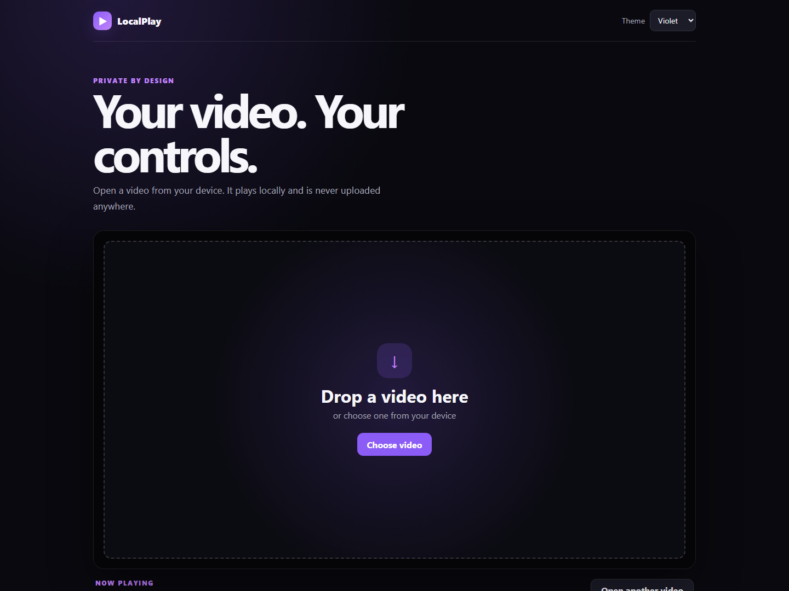

<div align="center">

# LocalPlay

### Your video. Your controls. Your privacy.

A customizable, local-first video player built with plain HTML, CSS, and JavaScript.


</div>



## About

LocalPlay lets people open and watch videos directly in their browser. Files are read locally with the browser's built-in file API, so they are never uploaded to a server.

The project is intentionally written without frameworks, packages, or a build system. It is suitable for beginners who want to explore custom media controls and for anyone who wants a simple private player.

## Highlights

- **Private local playback** — videos stay on the user's device
- **Drag and drop** — open a video without navigating complicated menus
- **Custom controls** — play, pause, seek, skip, volume, speed, and fullscreen
- **Picture in picture** — continue watching in a floating window where supported
- **Local subtitles** — load WebVTT (`.vtt`) caption files
- **Smart bookmarks** — save and revisit timestamps for each video
- **Frame snapshots** — download the current video frame as a PNG
- **Personalization** — choose from Violet, Ocean, and Sunset themes
- **Theater mode** — create a larger, distraction-free viewing area
- **Keyboard friendly** — control the main player actions without a mouse
- **Responsive design** — adapts to desktop, tablet, and mobile screens

## Quick start

LocalPlay has no dependencies and requires no installation.

1. Download or clone this repository.
2. Open `index.html` in a modern browser.
3. Drop a video into the player or select **Choose video**.

For the most consistent browser behavior, run the folder with VS Code Live Server or another simple static web server.

## Keyboard shortcuts

| Key | Action |
| --- | --- |
| `Space` | Play or pause |
| `Left arrow` | Go back 10 seconds |
| `Right arrow` | Go forward 10 seconds |
| `M` | Mute or unmute |
| `F` | Enter or exit fullscreen |
| `P` | Toggle picture in picture |
| `B` | Add a bookmark |

## Subtitle files

LocalPlay accepts WebVTT subtitle files with the `.vtt` extension. A basic file looks like this:

```vtt
WEBVTT

00:00:01.000 --> 00:00:04.000
Welcome to LocalPlay.

00:00:05.000 --> 00:00:08.000
Your video stays on your device.
```

## Privacy

LocalPlay does not include a server, database, analytics, advertising, or third-party JavaScript. Selecting a video creates a temporary local browser URL with `URL.createObjectURL()`.

Only the selected theme and bookmark timestamps are saved with `localStorage`. The actual video and subtitle files are not copied or stored by the application.

## Browser and format support

The core player works in current versions of Chrome, Edge, Firefox, and Safari. Actual video format support is controlled by the browser and operating system. MP4 with H.264 video and AAC audio generally provides the widest compatibility.

Picture-in-picture availability also depends on the browser. LocalPlay hides that control when the feature is unavailable.

## Project structure

```text
localplay/
├── assets/
│   ├── localplay-icon.svg
│   └── localplay-preview.png
├── index.html
├── style.css
├── script.js
├── CONTRIBUTING.md
├── CHANGELOG.md
├── LICENSE
└── README.md
```

## Customize it

- Change the page content and control markup in `index.html`.
- Change colors, spacing, and responsive styles in `style.css`.
- Change player behavior and add features in `script.js`.

The theme colors are CSS variables near the top of `style.css`, making them a good beginner-friendly place to start.

## Deploy with GitHub Pages

1. Push the project to a public GitHub repository.
2. Open the repository's **Settings**.
3. Select **Pages**.
4. Under **Build and deployment**, choose **Deploy from a branch**.
5. Select the `main` branch and the `/ (root)` folder.
6. Save and wait for GitHub to display the public URL.

No additional build command is required.

## Limitations

- Browser codec support varies, so not every video file can play everywhere.
- The browser must support picture in picture for that feature to appear.
- Bookmarks stay in the current browser and are not synchronized between devices.
- LocalPlay is a client-side player; it does not host or permanently upload videos.

## Roadmap

- Playlist support
- Custom subtitle styling
- Video rotation and aspect-ratio controls
- Installable progressive web app support
- More theme customization

Ideas and beginner-friendly contributions are welcome. See [CONTRIBUTING.md](CONTRIBUTING.md) to get started.

## License

LocalPlay is open-source software available under the [MIT License](LICENSE).
